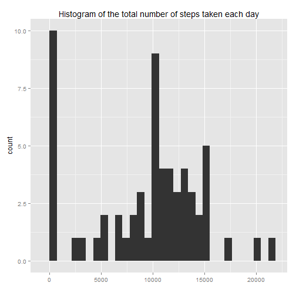
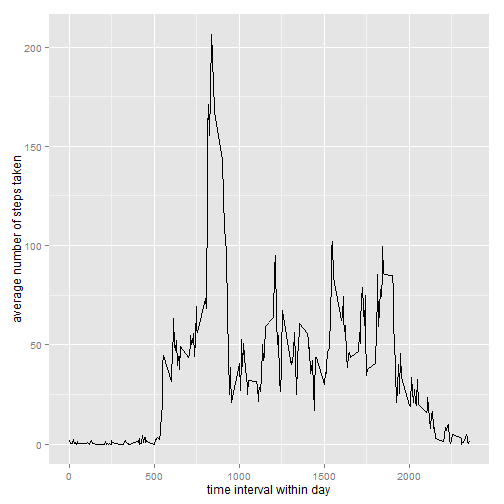
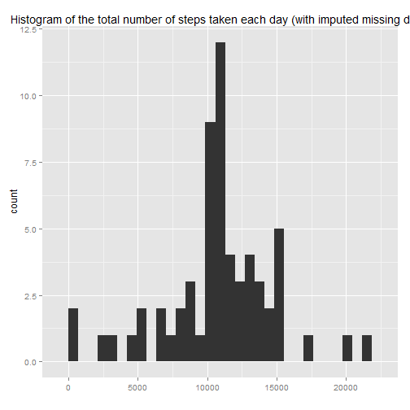
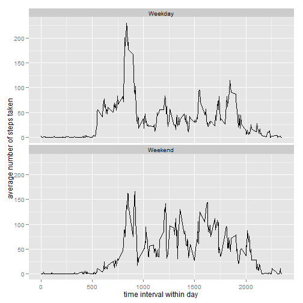

###Loading and preprocessing the data. 

First, we load the data into R and tell R that the second column is in a date format.


```r
mydata<-read.csv("activity.csv")
mydata$date<-as.Date(mydata$date,format="%Y-%m-%d")
```

We can look at the first few rows of the data frame to see the structure


```r
head(mydata)
```

```
##   steps       date interval
## 1    NA 2012-10-01        0
## 2    NA 2012-10-01        5
## 3    NA 2012-10-01       10
## 4    NA 2012-10-01       15
## 5    NA 2012-10-01       20
## 6    NA 2012-10-01       25
```

## What is the mean total number of steps taken per day?

First, we sum the total number of steps each day.


```r
require(plyr)
```

```
## Loading required package: plyr
```

```r
mydataSums<-ddply(mydata,.(date),summarize,totalSteps=sum(steps,na.rm=T))
```

We first look at the histogram of the data to look at the skew.


```r
require(ggplot2)
```

```
## Loading required package: ggplot2
```

```r
qplot(mydataSums$totalSteps, geom="histogram",main="Histogram of the total number of steps taken each day",xlab="")
```

```
## stat_bin: binwidth defaulted to range/30. Use 'binwidth = x' to adjust this.
```

 

Next, we calculate the mean total number of steps taken per day. 


```r
meanTotalSteps=mean(mydataSums$totalSteps,na.rm=T)
medianTotalSteps=median(mydataSums$totalSteps,na.rm=T)
```

The mean total number of steps taken each day is 9354.2295082.
The median total number of steps taken each day is 10395.

## What is the average daily activity pattern?

First, we calculate the average number of steps at each time interval and plot a time series of the data.


```r
mydataAverage<-ddply(mydata,.(interval),summarize,avSteps=mean(steps,na.rm=T))
qplot(interval,avSteps,geom="path",data=mydataAverage, xlab="time interval within day",ylab="average number of steps taken")
```

 

To find out which time intervals contains and maximum number of steps, we can sort the data frame rows by descending number of steps and then look at the first rows of the data.


```r
mydataAverage<-mydataAverage[order(mydataAverage$avSteps,decreasing=T),]
head(mydataAverage)
```

```
##     interval  avSteps
## 104      835 206.1698
## 105      840 195.9245
## 107      850 183.3962
## 106      845 179.5660
## 103      830 177.3019
## 101      820 171.1509
```

This shows that the time interval 835 contains the maximum number.

## Imputing missing values

How many missing values are there?


```r
length(mydata$steps[is.na(mydata$steps)])
```

```
## [1] 2304
```

We replicate the data set and impute missing values with the mean for that time interval as calculated across all time intervals with data.


```r
mydata$avSteps<-mydataAverage$avSteps[match(mydata$interval,mydataAverage$interval)]
mydataImputed<-mydata
mydataImputed$steps[is.na(mydata$steps)]<-mydata$avSteps[is.na(mydata$steps)]
```

To see what was the impact of the missing values, we repeat the code earlier and fisrt get the total number of steps taken per day.


```r
mydataSumsImputed<-ddply(mydataImputed,.(date),summarize,totalSteps=sum(steps))
```

We first look at the histogram of the data to look at the skew.


```r
require(ggplot2)
qplot(mydataSumsImputed$totalSteps, geom="histogram",main="Histogram of the total number of steps taken each day (with imputed missing data)",xlab="")
```

```
## stat_bin: binwidth defaulted to range/30. Use 'binwidth = x' to adjust this.
```

 

Next, we calculate the mean total number of steps taken per day. 


```r
meanTotalSteps=mean(mydataSumsImputed$totalSteps,na.rm=T)
medianTotalSteps=median(mydataSumsImputed$totalSteps,na.rm=T)
```

The mean total number of steps taken each day is 1.0766189 &times; 10<sup>4</sup>.
The median total number of steps taken each day is 1.0766189 &times; 10<sup>4</sup>.
Thus, the missing data lead to an underestimation of the average number of steps taken.

## Are there differences in activity patterns between weekdays and weekends?

Lets create a new factor variable that specifies whether a date is a weekday or a weekend.


```r
mydataImputed$weekday<-weekdays(mydataImputed$date)
mydataImputed$Daytype<-sapply(mydataImputed$weekday,function(x)ifelse(x%in%c("Saturday","Sunday"),"Weekend","Weekday"))
```

Then get the average number of steps each time intervals for each and plot a time series of each.


```r
mydataAverage_bydaytype<-ddply(mydataImputed,.(interval,Daytype),summarize,avSteps=mean(steps,na.rm=T))
ggplot(mydataAverage_bydaytype,aes(interval,avSteps))+
         geom_path()+
         xlab("time interval within day")+
         ylab("average number of steps taken")+
         facet_wrap(~Daytype,ncol=1)
```

 

There does seem to be a difference in activity patterns, with earlier activity on weekdays and a large peak in the morning, presumably as people go to work.
